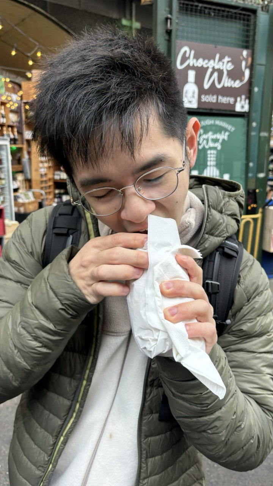
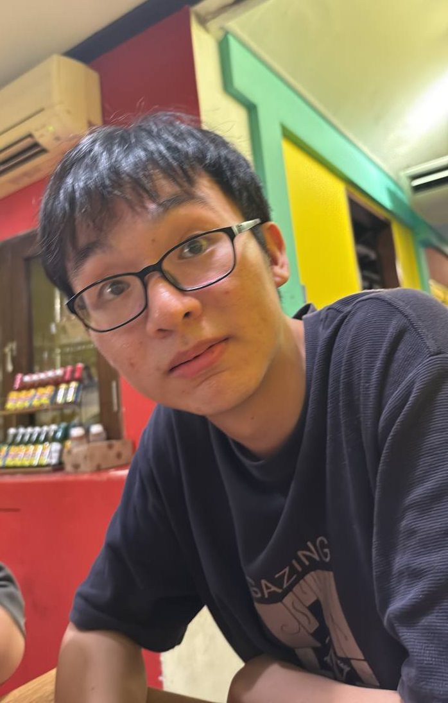
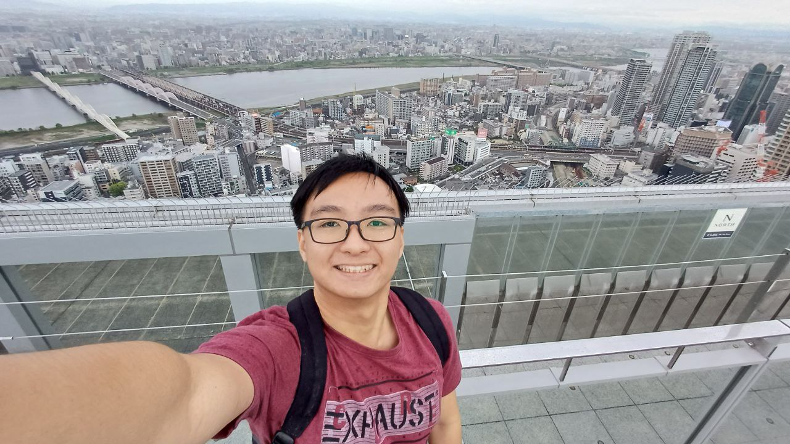
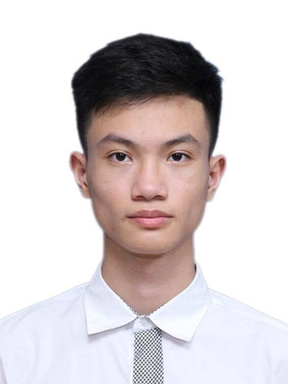

# About Us

We are a team based in the [School of Computing, National University of Singapore](http://www.comp.nus.edu.sg).

You can reach us at the email `seer[at]comp.nus.edu.sg`

## Project team

### Jonathan Chng

[[github](https://github.com/jonchng)]

* Role: Developer
* Responsibilities: QA Tester

### Wang Boqian

[[github](http://github.com/Retribob)]
[[portfolio](https://github.com/Retribob)]

* Role: Developer
* Responsibilities: Documentation

### nob-s

[[github](http://github.com/nob-s)]
[[portfolio](http://github.com/nob-s)]

* Role: Developer
* Responsibilities: Code Quality + Integration

### Xirnic

[[github](https://github.com/Xirnic)]

* Role: Developer
* Responsibilities: Testing

### Brian (Quoc Bao)

[[github](https://github.com/QuocBaoVu)]
[[portfolio](team/johndoe.md)]

* Role: Developer
* Responsibilities: UI
