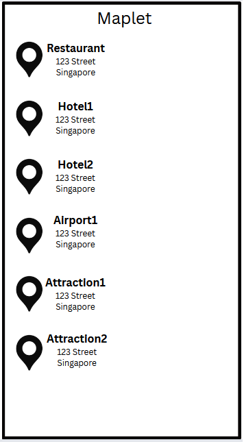
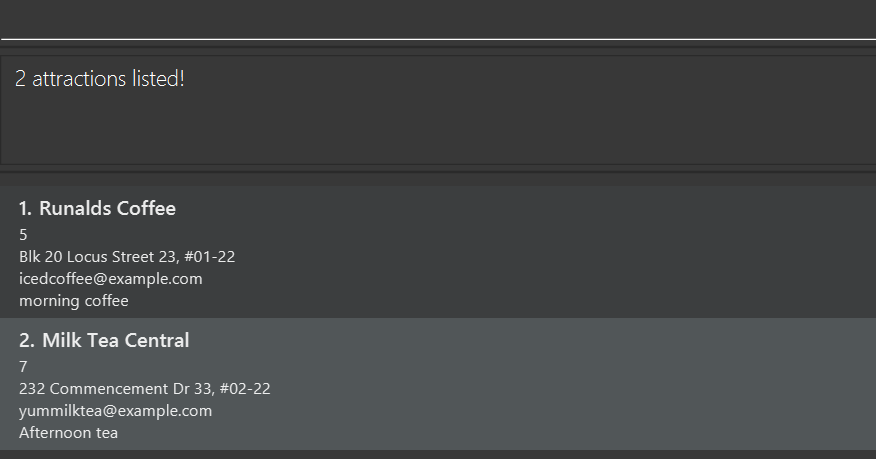

# Maplet User Guide

Maplet caters to individuals that are **planning to go overseas** or are **frequent travellers**. Maplet is a **desktop app for managing places you want to visit**, optimized for use via a **Command Line Interface** (CLI) while still having the benefits of a Graphical User Interface (GUI). If you can type fast, Maplet can get your trip planning tasks done faster than traditional GUI apps.
<!-- * Table of Contents -->
<page-nav-print />

--------------------------------------------------------------------------------------------------------------------

## Quick start

1. Ensure you have Java `17` or above installed in your Computer. 
   **Mac users:** Ensure you have the precise JDK version prescribed [here](https://se-education.org/guides/tutorials/javaInstallationMac.html).

1. Download the latest `.jar` file from [here](https://github.com/AY2526S1-CS2103T-W12-1/tp/releases).

1. Copy the file to the folder you want to use as the _home folder_ for Maplet.

1. Open a command terminal, `cd` into the folder you put the jar file in, and use the `java -jar maplet.jar` command to run the application. 
   A GUI similar to the below should appear in a few seconds. Note how the app contains some sample data. 
   

1. Type the command in the command box and press Enter to execute it. e.g. typing **`help`** and pressing Enter will open the help window. 
   Some example commands you can try:

   * `list` : Lists all attractions.

   * `add n/Eiffel Tower p/9 c/example@gmail.com, a/Paris, act/climb tower t/bucket list t/with friends`: Adds an attraction called Eiffel Tower

   * `delete 3` : Deletes the 3rd attraction shown in the current list.

   * `clear` : Deletes all attractions.

   * `exit` : Exits the app.

   * `addlocation ln/Singapore i/1`: Adds attraction with index 1 to location Singapore

  * 5. Refer to the [Features](#features) below for details of each command.

--------------------------------------------------------------------------------------------------------------------

## Features

<box type="info" seamless>

**Notes about the command format:** 

* Words in `UPPER_CASE` are the parameters to be supplied by the user. 
  e.g. in `add n/NAME`, `NAME` is a parameter which can be used as `add n/Eiffel Tower`.

* Items in square brackets are optional. 
  e.g `n/NAME [t/TAG]` can be used as `n/Eiffel Tower t/bucket list` or as `n/Eiffel Tower`.

* Items with `…`​ after them can be used multiple times including zero times. 
  e.g. `[t/TAG]…​` can be used as ` ` (i.e. 0 times), `t/bucket list`, `t/bucket list t/with friends` etc.

* Parameters can be in any order. 
  e.g. if the command specifies `n/NAME p/PRIORITY`, `p/PRIORITY n/NAME` is also acceptable.

* Extraneous parameters for commands that do not take in parameters (such as `help`, `list`, `exit` and `clear`) will be ignored. 
  e.g. if the command specifies `help 123`, it will be interpreted as `help`.

* If you are using a PDF version of this document, be careful when copying and pasting commands that span multiple lines as space characters surrounding line-breaks may be omitted when copied over to the application.
</box>

--------------------------------------------------------------------------------------------------------------------

## Command summary

Action     | Format, Examples
-----------|----------------------------------------------------------------------------------------------------------------------------------------------------------------------
**Add**    | `add n/NAME p/PRIORITY_NUMBER c/CONTACT a/ADDRESS [t/TAG]…​`   e.g., `add n/Universal Village p/4 c/UniVillage@example.com a/123, Clementi Rd, 1234665 t/movies t/leisure`
**Clear**  | `clear`
**Delete** | `delete INDEX`  e.g., `delete 3`
**Edit**   | `edit INDEX [n/NAME] [p/PRIORITY_NUMBER] [c/CONTACT] [a/ADDRESS] [t/TAG]…​`  e.g.,`edit 2 n/Golden Studios c/GoldenSS@example.com`
**Find**   | `find KEYWORD [MORE_KEYWORDS]`  e.g., `find Golden Studios`
**Sort**   | `sort PREFIX`  e.g., `sort p/`
**Add Location**   | `addlocation ln/LOCATION_NAME i/ATTRACTION_INDEX [i/ATTRACTION_INDEX]…`  e.g., `addlocation ln/Singapore i/1 i/2 i/3`
**Delete Location**   | `deletelocation ln/LOCATION_NAME`  e.g., `deletelocation ln/Singapore`
**List**   | `list`
**Help**   | `help`

### Viewing help : `help`

Shows a message explaining how to access the help page.

Format: `help`

### Adding an attraction: `add`

Adds an attraction to Maplet.

Format: `add n/NAME p/PRIORITY c/CONTACT a/ADDRESS act/ACTIVITIES [t/TAG]…​`

<box type="tip" seamless>

**Tip:** An attraction can have any number of tags (including 0)
</box>

Examples:
* `add n/Big ben a/London, c/hello@gmail.com, p/5, act/listen to ben`
* `add n/Eiffel Tower p/9 c/example@gmail.com, a/Paris, act/climb tower t/bucket list t/with friends`

### Listing all attractions : `list`

Shows a list of all attractions in Maplet.

Format: `list`

### Editing an attraction : `edit`

Edits an existing attraction in Maplet.

Format: `edit INDEX [n/NAME] [p/PHONE] [c/CONTACT] [a/ADDRESS] [act/ACTIVITIES] [t/TAG]…​`

* Edits the attraction at the specified `INDEX`. The index refers to the index number shown in the displayed attraction list. The index **must be a positive integer** 1, 2, 3, …​
* At least one of the optional fields must be provided.
* Existing values will be updated to the input values.
* When editing tags, the existing tags of the attraction will be removed i.e adding of tags is not cumulative.
* You can remove all the attraction’s tags by typing `t/` without
    specifying any tags after it.

Examples:
*  `edit 1 p/9 c/orangerestaurant@example.com` Edits the priority value and contact detail of the 1st attraction to be `9` and `orangerestaurant@example.com` respectively.
*  `edit 2 n/Golden Star t/` Edits the name of the 2nd attraction to be `Golden Star` and clears all existing tags.

### Locating attractions by name: `find`

Finds attractions whose names contain any of the given keywords.

Format: `find KEYWORD [MORE_KEYWORDS]`

* The search is case-insensitive. e.g `milk` will match `Milk`
* The order of the keywords does not matter. e.g. `Tea Milk` will match `Milk Tea`
* Only the name is searched.
* Only full words will be matched e.g. `Gold` will not match `Golden`
* Attractions matching at least one keyword will be returned (i.e. `OR` search).
  e.g. `Golden Stop` will return `Golden Studios`, `Golden Star`

Examples:
* `find Golden` returns `Golden Studios` and `Golden Fries`
* `find Coffee Tea` returns `Runalds Coffee`, `Milk Tea Central` 
  

### Deleting an attraction : `delete`

Deletes the specified attraction from Maplet.

Format: `delete INDEX`

* Deletes the attraction at the specified `INDEX`.
* The index refers to the index number shown in the displayed attraction list.
* The index **must be a positive integer** 1, 2, 3, …​

Examples:
* `list` followed by `delete 2` deletes the 2nd attraction in Maplet.
* `find Cat Cafe` followed by `delete 1` deletes the 1st attraction in the results of the `find` command.

### Sorting attractions and itineraries: `sort`

Sorts all attractions and itineraries in Maplet based on the specified prefix.

Format: `sort PREFIX`

* Sorts all attractions and itineraries in the following order depending on the specified `PREFIX`.
* `PREFIX` can be one of the following:
  * `n/` : Sorts attractions and itineraries in alphabetical order of names (A to Z) 
  * `p/` : Sorts attractions in descending order of priority (High to Low), 
           and itineraries in descending order of their cumulative attractions' priority
  * `pr/` : Sorts attractions in ascending order of price (Cheapest to Most Expensive),
            and itineraries in ascending order of their cumulative attractions' price

Examples:
* `sort n/` sorts all attractions and itineraries in alphabetical order of names (A to Z)
* `sort p/` sorts all attractions and itineraries in based on priority (High to Low)

### Adding a location: `addlocation`

Adds an location to Maplet.

Format: `addlocation ln/LOCATION_NAME i/ATTRACTION_INDEX [i/ATTRACTION_INDEX ]…​`

<box type="tip" seamless>

**Tip:** An Attraction can belong many Location, but in one Location, a Attraction is unique.
</box>

Examples:
* `addlocation ln/Singpore i/1 i/2`
* `addlocation n/Paris i/5 i/7 i/9`

### Deleting a location : `deletelocation`

Deletes the specified location from Maplet.

Format: `deletelocation ln/LOCATION_NAME`

* Deletes the attraction with the specified name `LOCATION_NAME`.

Examples:

* `deletelocation ln/Singapore` deletes the location `Singapore`.

### Clearing all entries : `clear`

Clears all entries from Maplet.

Format: `clear`

### Exiting the program : `exit`

Exits the program.

Format: `exit`

### Saving the data

Maplet data is saved in the hard disk automatically after any command that changes the data. There is no need to save manually.

### Editing the data file

Maplet data is saved automatically as a JSON file `[JAR file location]/data/maplet.json`. Advanced users are welcome to update data directly by editing that data file.

<box type="warning" seamless>

**Caution:**
If your changes to the data file makes its format invalid, Maplet will discard all data and start with an empty data file at the next run.  Hence, it is recommended to take a backup of the file before editing it. 
Furthermore, certain edits can cause Maplet to behave in unexpected ways (e.g., if a value entered is outside the acceptable range). Therefore, edit the data file only if you are confident that you can update it correctly.
</box>

### Archiving data files `[coming in v2.0]`

_Details coming soon ..._

--------------------------------------------------------------------------------------------------------------------

## FAQ

**Q**: How do I transfer my data to another Computer? 
**A**: Install the app in the other computer and overwrite the empty data file it creates with the file that contains the data of your previous Maplet home folder.

--------------------------------------------------------------------------------------------------------------------

## Known issues

1. **When using multiple screens**, if you move the application to a secondary screen, and later switch to using only the primary screen, the GUI will open off-screen. The remedy is to delete the `preferences.json` file created by the application before running the application again.
2. **If you minimize the Help Window** and then run the `help` command (or use the `Help` menu, or the keyboard shortcut `F1`) again, the original Help Window will remain minimized, and no new Help Window will appear. The remedy is to manually restore the minimized Help Window.
