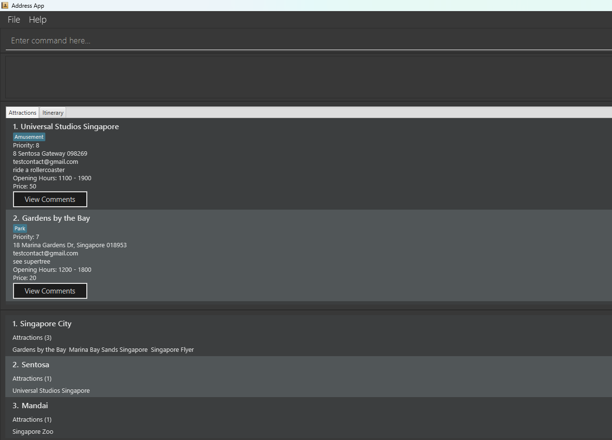
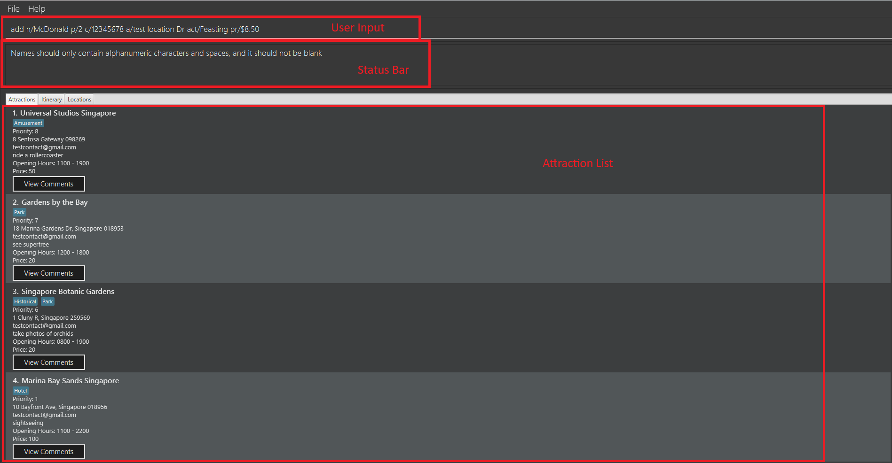
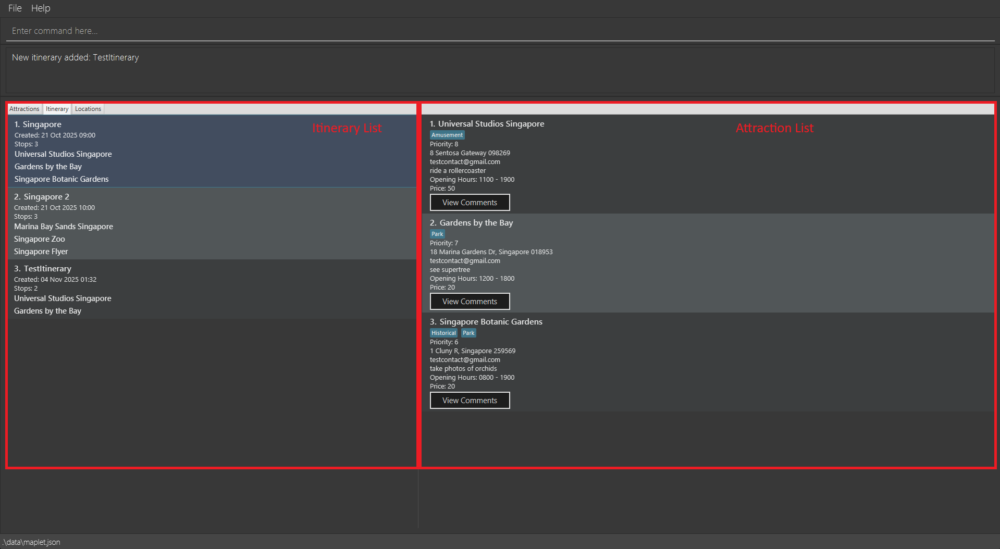
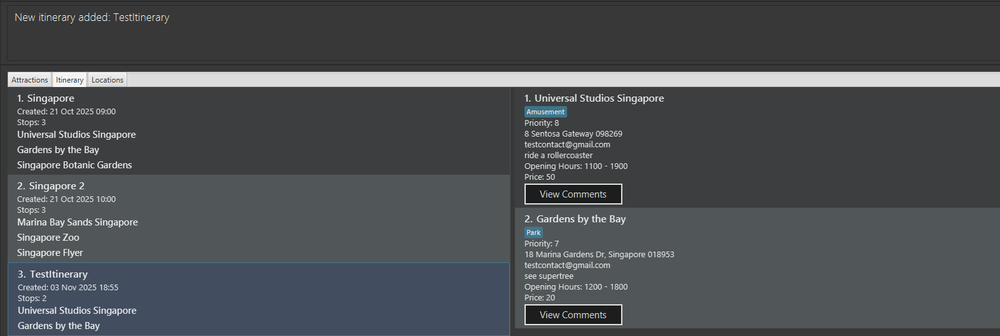
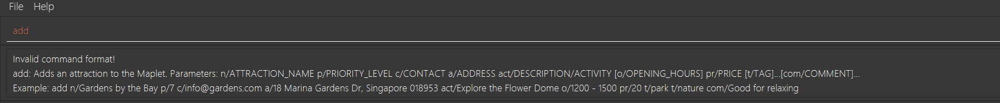

# Maplet User Guide
Welcome to Maplet, your goto solution for trip planning.

<!-- * Table of Contents -->
<page-nav-print />

-------------------------------------------------------------------------------------------------------------------

## Introduction
If you often find yourself bookmarking attractions online but forgetting them later, or struggling to prioritize destinations for a trip, **Maplet** is built for you.

It’s a **desktop app for managing travel attractions and itineraries**, designed for efficiency through a **Command Line Interface (CLI)** paired with a **Graphical User Interface (GUI)** allowing you to type commands quickly while still visualizing your data.

Whether you’re a **travel content creator** categorizing attractions for your next viral trip or a **student planning your next overseas trip with friends**, Maplet helps you plan smarter and faster.


### Target Audience
Maplet is designed for:
- **Travel enthusiasts** who want to plan and organize trips efficiently.  
- **Frequent flyers and planners** who handle multiple destinations and itineraries.
- **Anyone** looking for a quick and easy way to plan an upcoming trip.

You’ll get the most out of Maplet if you:
- Can navigate a terminal (e.g., use `cd` or `java -jar`).  
- Have **Java 17 or higher** installed on your computer.

Unsure on the above? Fret not! Refer to our [Quick start](#quick-start) guide to get you started!

### What You Can Do with Maplet

### Attraction List

| What You Can Do | Description |
|-----------------|-------------|
| **Add attractions** | Record any new attraction you come across online with a single command. |
| **Customize details** | Each attraction has editable fields such as priority, cost to help you plan effectively. |
| **Sort by criteria** | Sort attractions by name, price, or priority to focus on what matters most. |
| **Find by keyword** | Quickly search through attractions using relevant keywords. |

---

### Location Grouping

| What You Can Do | Description |
|-----------------|-------------|
| **Group attractions** | Combine attractions that are in the same area. |
| **Add or remove** | Add or remove attractions from a location as your plans change. |
| **Create new locations** | Build your own custom location groups for better organization. |

---

### Itinerary Planning

| What You Can Do | Description |
|-----------------|-------------|
| **Create itineraries** | Plan custom trips by grouping attractions into one itinerary. |
| **Add attractions** | Include specific attractions to map out your day-by-day plan. |
| **Sort for optimization** | Sort itineraries by total cost or average priority to compare plans. |

--------------------------------------------------------------------------------------------------------------------

## Quick Start

Follow these simple steps to install and start using **Maplet**.

---

### 1. Check your Java setup
Ensure you have **Java 17 or higher** installed.

> **Mac users:**  
> Follow the official [installation guide](https://se-education.org/guides/tutorials/javaInstallationMac.html) for the correct JDK version.

You can verify your version by running:
```bash
java -version
```

Ensure you see something like:
```
openjdk version "17.x.x" 2025-01-21 LTS
```
---

### 2. Download Maplet
Download the latest `.jar` file from the [Maplet GitHub Releases page](https://github.com/AY2526S1-CS2103T-W12-1/tp/releases).

Download it to a folder of your choice, this will be your **home folder** where all your data will be automatically saved.

> **Warning:**  
> Keep the file name as `maplet.jar` to avoid any compatibility issues.

---

### 3. Launch Maplet
Open your terminal and run:
```bash
cd [your-folder-name]
java -jar maplet.jar
```
After a few seconds, Maplet will appear with sample attractions preloaded.


*Figure 1. Maplet interface showing sample data.*

---

### 4. Try a few commands
Type commands in the command box and press **Enter**:

| Command | Description |
|----------|--------------|
| `help` | Opens the help window. |
| `list` | Displays all attractions. |
| `add n/Eiffel Tower p/9 a/Paris act/climb tower pr/$200` | Adds an attraction called **Eiffel Tower**. |
| `delete 3` | Deletes the attraction at index 3 shown in the current list. |
| `addlocation ln/Singapore i/1` | Adds attraction with index 1 to location "Singapore". |
| `addlocation ln/Singapore i/1` | Adds attraction with index 1 to location "Singapore". |
| `additinerary n/Singapore Trip ai/1 ai/2` | Creates an itinerary called "Singapore Trip" with the attractions that are at index 1 and 2. |
| `clear` | Deletes all attractions. |
| `exit` | Closes the app. |


<box type="tip" seamless>
**Tip 1:** Use the `help` command anytime to see all available actions.
 
**Tip 2:** Refer to the [Commands](#features) below for details of each command.
</box>
---

### You’re ready to go!
Start adding attractions, group them by location, and build your first itinerary.  
Next, visit the [Navigation](#navigation) section to explore how each panel works.


--------------------------------------------------------------------------------------------------------------------
## Navigation
This section guides you through the main panel options of **Maplet** so you can move between **attractions, itineraries and locations**. 


#### Attraction Panel

*Figure 2. Attraction Panel*

The **Attraction Panel** appears first when launching the application. It has **3** main components:
| Section | Description |
|----------|--------------|
| **User Input** | Enter your commands here to manage your attractions. |
| **Status Bar** | Displays messages confirming whether your command was successful or not. If there’s an error, the message explains what went wrong. |
| **Attraction List** | Shows all the attractions you’ve added. Each entry contains user-defined information such as name, cost, and priority. |

<box type="tip" seamless>
**Tip:** To start adding attractions, refer to the [Adding an Attraction](#adding-an-attraction-add) section.
</box>

### Itinerary Panel
To open the **Itinerary Panel**, click on the *Itinerary* button above the attraction list, or use the `Tab` and arrow keys to navigate there.

*Figure 3. Itinerary Panel overview.*

| Section | Description |
|----------|--------------|
| **Itinerary List** | Displays all your saved itineraries. |
| **Attraction List** | Shows the attractions linked to the selected itinerary. |

<box type="tip" seamless> 
**Tip:** To add an itinerary refer to the [add an itinerary](#adding-an-itinerary-additinerary) section.
</box>

### Location Panel
Finally, navigate to the **Location Panel** by clicking the *Location* button or using the `Tab` and arrow keys.


*Figure 4. Location Panel overview.*

| Section | Description |
|----------|--------------|
| **Location List** | Lists all user defined location. |
| **Attraction List** | Displays attractions assigned to the selected location. |

<box type="tip" seamless>
**Tip:** To add a location refer to the [add a location](#adding-a-location-addlocation) section.
</box>

-------------------------------------------------------------------------------------------------------------------------------------------------------

## Commands

Commands are the main method for perform operation in the **Maplet** application. 

<box type="info" seamless>

**Notes about the command format:**<br>

| Format Element | Description | Example |
|----------------|--------------|----------|
| **UPPER_CASE** | Placeholder for a parameter to be supplied by you. | `add n/NAME` -> `add n/Eiffel Tower` where `NAME` is replaced with `Eiffel Tower`|
| **[Square Brackets]** | Optional parameter. | `n/NAME [t/TAG]` → `n/Eiffel Tower t/bucketlist` or just `n/Eiffel Tower` |
| **Ellipsis `…`** | Parameter can any amount of times. | `[t/TAG]…` → `t/movies t/leisure` or `t/`|
| **Order Flexibility** | Parameters can appear in any order. | `p/PRIORITY n/NAME` works like `n/NAME p/PRIORITY` |
| **Extra Parameters Ignored** | Commands like `help`, `list`, and `exit` ignore extra text. | `help 123` → works like `help` |


> Warning for PDF Users: Be careful when copying and pasting commands that span multiple lines as space characters surrounding line-breaks may be omitted when copied over to the application.
</box>

### Command summary

Action     | Format, Examples
-----------|----------------------------------------------------------------------------------------------------------------------------------------------------------------------
**Add**    | `add n/NAME p/PRIORITY_NUMBER c/CONTACT a/ADDRESS act/ACTIVITIES [o/OPENING_HOURS] pr/PRICE [t/TAG]… [com/COMMENT]…​` <br> e.g., `add n/Universal Village p/4 c/UniVillage@example.com a/123, Clementi Rd, 1234665 act/Date pr/ 10USD t/movies t/leisure com/This place has a lot of rides but they have long queues.`
**Clear**  | `clear`
**Delete** | `delete INDEX`<br> e.g., `delete 3`
**Edit**   | `edit INDEX [n/NAME] [p/PRIORITY_NUMBER] [c/CONTACT] [a/ADDRESS] [o/OPENING_HOURS] [pr/PRICE] [t/TAG]… [c/COMMENT]…​`<br> e.g.,`edit 2 n/Golden Studios c/GoldenSS@example.com`
**Find**   | `find KEYWORD [MORE_KEYWORDS]`<br> e.g., `find Golden Studios`
**Sort**   | `sort PREFIX`<br> e.g., `sort p/`
**Add Location**   | `addlocation ln/LOCATION_NAME i/ATTRACTION_INDEX [i/ATTRACTION_INDEX]…`<br> e.g., `addlocation ln/Singapore i/1 i/2 i/3`
**Delete Location**   | `deletelocation ln/LOCATION_NAME`<br> e.g., `deletelocation ln/Singapore`
**Edit Location**   | `editlocation ln/LOCATION_NAME action/ACTION i/ATTRACTION_INDEX`<br> e.g., `editlocation ln/Singapore action/ADD i/5`
**Add Itinerary**   | `additinerary n/ITINERARY_NAME [ai/ATTRACTION_INDEX]…`<br> e.g., `additinerary n/Singapore Trip ai/1 ai/2`
**Delete Itinerary**   | `deleteitinerary INDEX`<br> e.g., `deleteitinerary 1`
**List**   | `list`
**Help**   | `help`

### Parameter prefixes
Prefixes are used before parameters to help the program differentiate between different types of parameters. Below is a comprehensive list of prefix-parameter pairs.

Prefix            |          Parameter
------------------|---------------------------------------------------------------------------------------------------------------------------------------------------------------
n/                | NAME
p/                | PRIORITY_NUMBER
c/                | CONTACT
a/                | ADDRESS
act/              | ACTIVITIES
o/                | OPENING_HOURS
pr/               | PRICE
t/                | TAG
c/                | COMMENT
i/                | ATTRACTION_INDEX (LOCATIONS)
ai/               | ATTRACTION_INDEX (ITINERARY)

### Parameter restrictions
As seen in the command summary a parameter is a stand-in for user input. These parameters are directly after their corresponding prefix.
Each parameter has a corresponding restriction that prevents users from keying in nonsense data.

Parameter         |          Restriction
------------------|---------------------------------------------------------------------------------------------------------------------------------------------------------------
NAME                | Name of the attraction. Must be alphanumerical.
INDEX          | The index of each attraction. Must correspond to an existing attraction and cannot be negative.
PRIORITY_NUMBER              | A number that ranges from 1 - 10 (inclusive)
CONTACT   | A number containing at least 3 digits OR a valid email address of the form: `local-part@domain`
ADDRESS            | Any value as long as it's not blank
ACTIVITIES           | Any value as long as it's not blank
OPENING_HOURS       | Should take the form: `HHmm - HHmm`
PRICE     | Numerical value with the currency symbol or the 3-letter ISO code, and it should not be blank
TAG             | Alphanumeric (no spaces allowed) (Optional field)
COMMENT                | Any value as long as it's not blank (Optional field)
ATTRACTION_INDEX (LOCATIONS)            | The index of each attraction. Must correspond to an existing attraction and cannot be negative.
ATTRACTION_INDEX (ITINERARY)               | The index of each attraction. Must correspond to an existing attraction and cannot be negative.


### Attraction Commands
These commands are responsible to adding, editing and deleting attractions.

##### Adding an attraction: `add`

Adds an attraction to Maplet.

Format: `add n/NAME p/PRIORITY c/CONTACT a/ADDRESS act/ACTIVITIES [o/OPENING_HOURS] pr/PRICE [t/TAG]… [com/COMMENT]…​`

<box type="tip" seamless>

**Tips:** 
- An attraction can have any number of tags and comments (including 0)
- If your command is invalid, refer to the status message below the user input

</box>

Examples:
* `add n/Big ben a/London c/hello@gmail.com p/5 act/listen to ben pr/SGD5`
* `add n/Eiffel Tower p/9 c/example@gmail.com a/Paris act/climb tower o/1200-1500 pr/500 t/bucketList t/friends`
* `add n/Pisa Tower p/9 c/hey123@gmail.com a/Italy act/phototaking pr/US$2 t/friends com/It's leaning!`

After adding an attraction successfully you will be able to see the following output as the status message.


##### Listing all attractions : `list`

Shows a list of all attractions in Maplet.

Format: `list`

<box type="tip" seamless>

**Tip:** This command is useful for displaying the original list after [filtering](#locating-attractions-by-name-find) or [sorting](#sorting-attractions-and-itineraries-sort)

</box>

##### Editing an attraction : `edit`

Edits an existing attraction in Maplet.

Format: `edit INDEX [n/NAME] [p/PHONE] [c/CONTACT] [a/ADDRESS] [act/ACTIVITIES] [o/OPENING_HOURS] [pr/PRICE] [t/TAG]… [com/COMMENT]…​`

* Edits the attraction at the specified `INDEX`. The index refers to the index number shown in the displayed attraction list. The index **must be a positive integer** 1, 2, 3, …​
* At least **one** of the optional fields must be provided.
* Existing values will be updated to the input values.

<box type="info" seamless>

**WARNING:** 
* When editing tags, the existing tags of the attraction will be removed i.e adding of tags is not cumulative.
* You can remove all the attraction’s tags by typing `t/` without
  specifying any tags after it.
* This applies for comments as well.
* If you wish to edit the current tag/comment consider using [dedit](#detailed-editing-of-an-attraction-dedit) command instead.

</box>

Examples:
*  `edit 1 p/9 c/orangerestaurant@example.com` Edits the priority value and contact detail of the 1st attraction to be `9` and `orangerestaurant@example.com` respectively.
*  `edit 2 n/Golden Star t/` Edits the name of the 2nd attraction to be `Golden Star` and clears all existing tags.

After a successful edit the status message should be as shown:


##### Detailed editing of an attraction: `dedit`

Edits the existing details of an attraction instead of replace the attributes.

Format : `dedit INDEX`

* Opens up a window with the attribute values of the attraction at the specified `INDEX`. The index refers to the index number shown in the displayed attraction list. The index **must be a positive integer** 1, 2, 3, …​
* You can hit ENTER after editing the field values to close the window and update the attraction.
* If you have provided invalid values for certain attributes, hitting ENTER will not close the window and an error message will be displayed in the status bar.
* You can press escape if you do not wish to discard changes.

Below is the sample window:


<box type="tip" seamless>

**Tip:** To avoid clicking on the fields to edit them one by one, consider using the `tab` key instead to swap between fields effortlessly!

</box>

Examples:
* `dedit 1` Opens the edit window for attraction 1.


##### Locating attractions by name: `find`

Finds attractions whose names contain any of the given keywords.

Format: `find KEYWORD [MORE_KEYWORDS]`

* The search is case-insensitive. e.g `milk` will match `Milk`
* The order of the keywords does not matter. e.g. `Tea Milk` will match `Milk Tea`
* Only the name is searched.
* Only full words will be matched e.g. `Gold` will not match `Golden`
* Attractions matching at least one keyword will be returned (i.e. `OR` search).
  e.g. `Golden Stop` will return `Golden Studios`, `Golden Star`

Examples:
* `find Golden` returns `Golden Studios` and `Golden Fries`
* `find Coffee Tea` returns `Runalds Coffee`, `Milk Tea Central`<br>
  

##### Deleting an attraction : `delete`

Deletes the specified attraction from Maplet.

Format: `delete INDEX`

* Deletes the attraction at the specified `INDEX`.
* The index refers to the index number shown in the displayed attraction list.
* The index **must be a positive integer** 1, 2, 3, …​

Examples:
* `list` followed by `delete 2` deletes the 2nd attraction in Maplet.
* `find Cat Cafe` followed by `delete 1` deletes the 1st attraction in the results of the `find` command.

<box type="info" seamless>

**WARNING**
* This action is irreversible!

</box>

##### Clearing all entries : `clear`

Clears all entries from Maplet.

Format: `clear`

<box type="info" seamless>

**WARNING**
* This action is irreversible!
* This will remove ALL attractions from Maplet.

</box>

##### Adding a comment: `comment`

Adds a comment to the specified attraction

Format: `comment INDEX com/COMMENT`

* Add the comment specified as `COMMENT` to the attraction at INDEX.
* INDEX refers to the index number shown in the attraction list.
* INDEX **must be a positive integer** 1, 2, 3, …​

Examples:
* `comment 1 com/Expensive place` Adds the comment "Expensive place" to the attraction at index 1.
* `comment 2 com/Terrible service` Adds the comment "Terrible service" to the attraction at index 2.

<box type="tip" seamless>

**Tip:** Instead of clicking on the view comments button, you can use `tab` to select the button and press `enter`
to view the comments instead!

</box>


### Itinerary Commands
These commands are responsible for managing itineraries

##### Adding an itinerary: `additinerary`

Adds an itinerary to Maplet. An itinerary is a collection of attractions that the user plans on visiting together.

Format: `additinerary n/ITINERARY_NAME [ai/ATTRACTION_INDEX]…​`

* Creates a new itinerary with the specified `ITINERARY_NAME`.
* You can add attractions to the itinerary by specifying their index numbers from the displayed attraction list.
* Each attraction can only be added once to an itinerary.
* The itinerary name must be unique (no two itineraries can have the same name).


Examples:
* `additinerary n/Singapore Trip ai/1 ai/2` creates an itinerary called "Singapore Runaround" with attractions at index 1 and 2
* `additinerary n/Europe Tour ai/3 ai/5 ai/7` creates an itinerary called "Europe Tour" with attractions at index 3, 5, and 7

If you have successfully added the itinerary you should see the following status message.




##### Deleting an itinerary : `deleteitinerary`

Deletes the specified itinerary from Maplet.

Format: `deleteitinerary INDEX`

* Deletes the itinerary at the specified `INDEX`.
* The index refers to the index number shown in the displayed itinerary list.
* The index **must be a positive integer** 1, 2, 3, …​

Examples:
* `deleteitinerary 1` deletes the 1st itinerary in the itinerary list.
* `deleteitinerary 3` deletes the 3rd itinerary in the itinerary list.


<box type="info" seamless>

**WARNING**
* This action is irreversible!

</box>


### Location Commands
These commands are responsible for managing locations

##### Adding a location: `addlocation`

Adds a location to Maplet so you can group related attractions together.

Format: `addlocation ln/LOCATION_NAME i/ATTRACTION_INDEX [i/ATTRACTION_INDEX]…​`

<box type="tip" seamless>

**Tip:** An attraction can belong to many locations, but each location can only list an attraction once.
</box>

Examples:
* `addlocation ln/Singapore i/1 i/2`
* `addlocation ln/Paris i/5 i/7 i/9`


Upon successfully adding a location you should see the following status message.


##### Editing a location: `editlocation`

Updates an existing location by adding or removing a single attraction using its index in the displayed attraction list.

Format: `editlocation ln/LOCATION_NAME action/ACTION i/ATTRACTION_INDEX`

* `ACTION` must be either `ADD` or `REMOVE` (case-insensitive).
* The attraction index refers to the current attraction list shown in the application.
* Adding an attraction that is already linked to the location is not allowed.
* Removing an attraction that is not part of the location, or removing the last attraction in the location, will show an error.

Examples:
* `editlocation ln/Singapore action/ADD i/5` adds the attraction at index 5 into the `Singapore` location.
* `editlocation ln/Singapore action/remove i/2` removes the attraction at index 2 from the `Singapore` location, as long as at least one attraction remains afterwards.

##### Deleting a location : `deletelocation`

Deletes the specified location from Maplet.

Format: `deletelocation ln/LOCATION_NAME`

* Deletes the attraction with the specified name `LOCATION_NAME`.

Examples:

* `deletelocation ln/Singapore` deletes the location `Singapore`.

<box type="info" seamless>

**WARNING**
* This action is irreversible!

</box>

### General Commands
These commands are responsible for general system operations.

##### Viewing help : `help`

Shows a message explaining how to access the help page.


Format: `help`


<box type="tip" seamless>

**Tip:** Not sure if your command worked or not? Refer to the status box right below the command textbox


</box>


##### Sorting attractions and itineraries: `sort`

Sorts all attractions and itineraries in Maplet based on the specified prefix.

Format: `sort PREFIX`

* Sorts all attractions and itineraries in the following order depending on the specified `PREFIX`.
* `PREFIX` can be one of the following:
    * `n/` : Sorts attractions and itineraries in alphabetical order of names (A to Z)
    * `p/` : Sorts attractions in descending order of priority (High to Low),
      and itineraries in descending order of their cumulative attractions' priority
    * `pr/` : Sorts attractions in ascending order of price (Cheapest to Most Expensive),
      and itineraries in ascending order of their cumulative attractions' price

Examples:
* `sort n/` sorts all attractions and itineraries in alphabetical order of names (A to Z)
* `sort p/` sorts all attractions and itineraries in based on priority (High to Low)

<box type="tip" seamless>

**Tip:** This command is great for finding which attractions or trip plans are most suitable for you.

</box>


##### Exiting the program : `exit`

Exits the program.

Format: `exit`

<box type="tip" seamless>

When exiting Maplet will save your attractions automatically!

</box>


## Other Features

#### Saving the data

Maplet data is saved in the hard disk automatically after any command that changes the data. There is no need to save manually.

#### Editing the data file

Maplet data is saved automatically as a JSON file `[JAR file location]/data/maplet.json`. Advanced users are welcome to update data directly by editing that data file.

<box type="warning" seamless>

**Caution:**
If your changes to the data file makes its format invalid, Maplet will discard all data and start with an empty data file at the next run.  Hence, it is recommended to take a backup of the file before editing it.<br>
Furthermore, certain edits can cause Maplet to behave in unexpected ways (e.g., if a value entered is outside the acceptable range). Therefore, edit the data file only if you are confident that you can update it correctly.
</box>

#### Archiving data files `[coming in v2.0]`

_Details coming soon ..._

--------------------------------------------------------------------------------------------------------------------

## FAQ

**Q**: How do I transfer my data to another Computer?<br>
**A**: Install the app in the other computer and overwrite the empty data file it creates with the file that contains the data of your previous Maplet home folder.

**Q**: Why is my command not working?
**A**: Refer to the status message for details! Note that commands keywords are case-sensitive.


--------------------------------------------------------------------------------------------------------------------

## Known issues

1. **When using multiple screens**, if you move the application to a secondary screen, and later switch to using only the primary screen, the GUI will open off-screen. The remedy is to delete the `preferences.json` file created by the application before running the application again.
2. **If you minimize the Help Window** and then run the `help` command (or use the `Help` menu, or the keyboard shortcut `F1`) again, the original Help Window will remain minimized, and no new Help Window will appear. The remedy is to manually restore the minimized Help Window.
